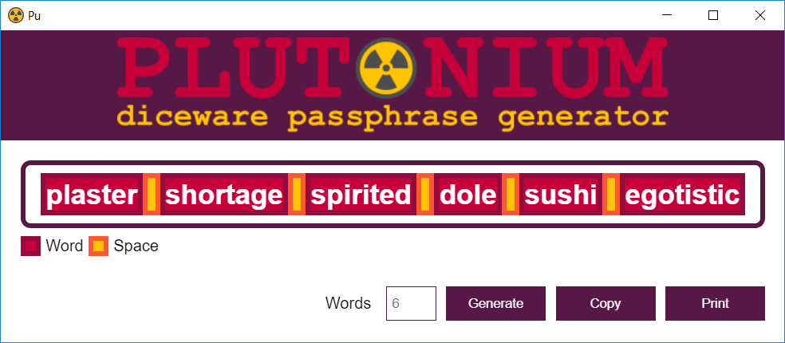
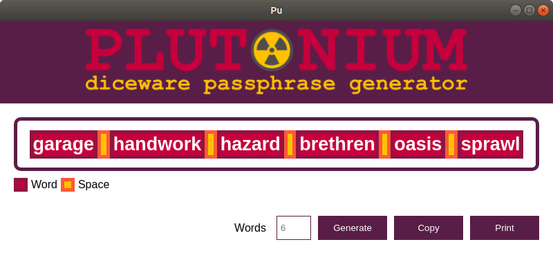

<p align="center">
    
</p>

# Plutonium

Plutonium is a passpharse generator that uses the [diceware method](https://www.eff.org/dice).

# Core

### Installation

```shellscript
$ npm install @plutonium/core
```

### Usage

```javascript
var Diceware   = require('@plutonium/core').Diceware;
var diceware   = new Diceware();
var passphrase = diceware.generate();

console.log(passphrase.toString());
```

# Application

⚠ On print, please, change in the printer settings the page orientation to landscape. Unfortunately, the Electron API does not support change this setting programmatically.

### Screenshot

<p align="center">
    
</p>

<p align="center">
    Windows
</p>

<p align="center">
    
</p>

<p align="center">
    Linux
</p>

# Development

### Bootstrap

```shell
$ yarn install
```

### Pack

```shell
$ yarn run pack
```

### Test

```shell
$ yarn run test
```

### Coverage

```shell
$ yarn run coverage
```

### Lint

```shell
$ yarn run lint
```
### Cleaning

```shell
$ yarn run clean
```

# Credits

Icon made by [Freepik](http://www.freepik.com) from [www.flaticon.com](https://www.flaticon.com)
